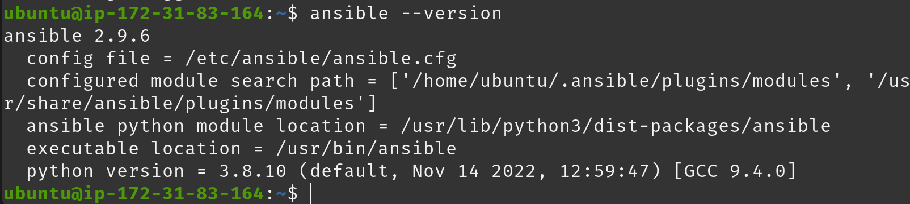
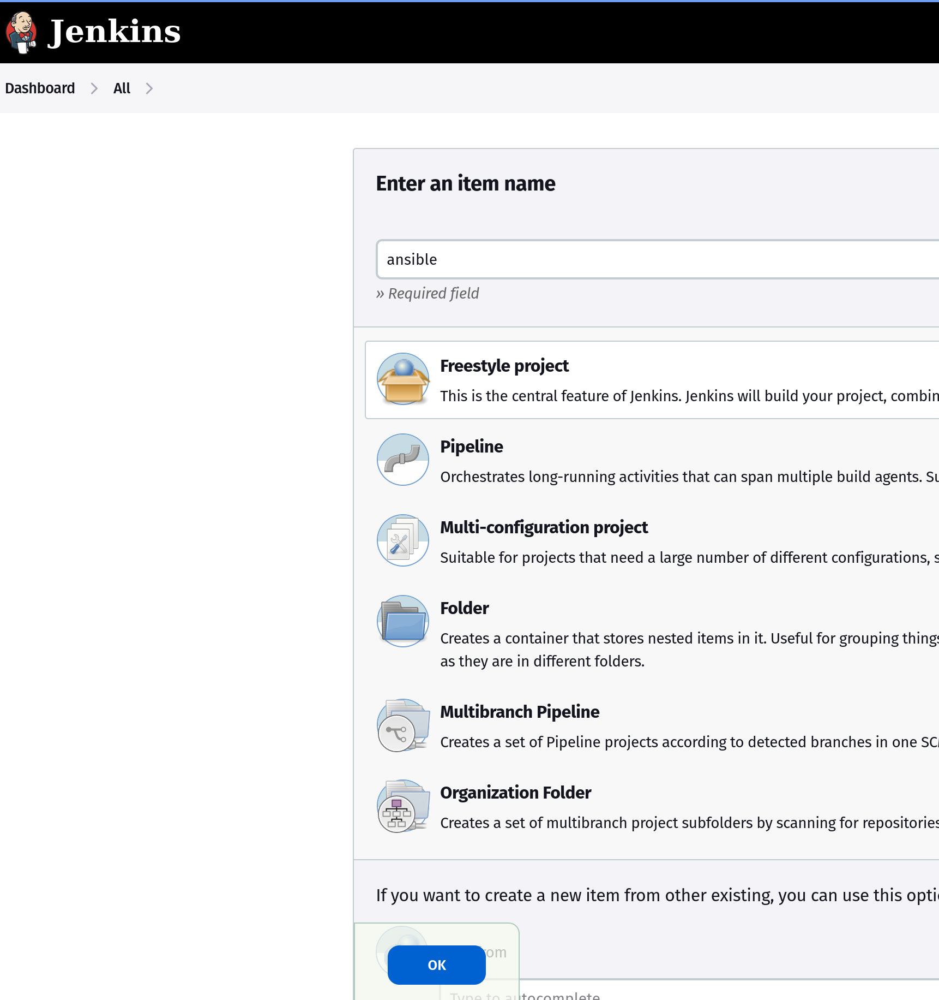
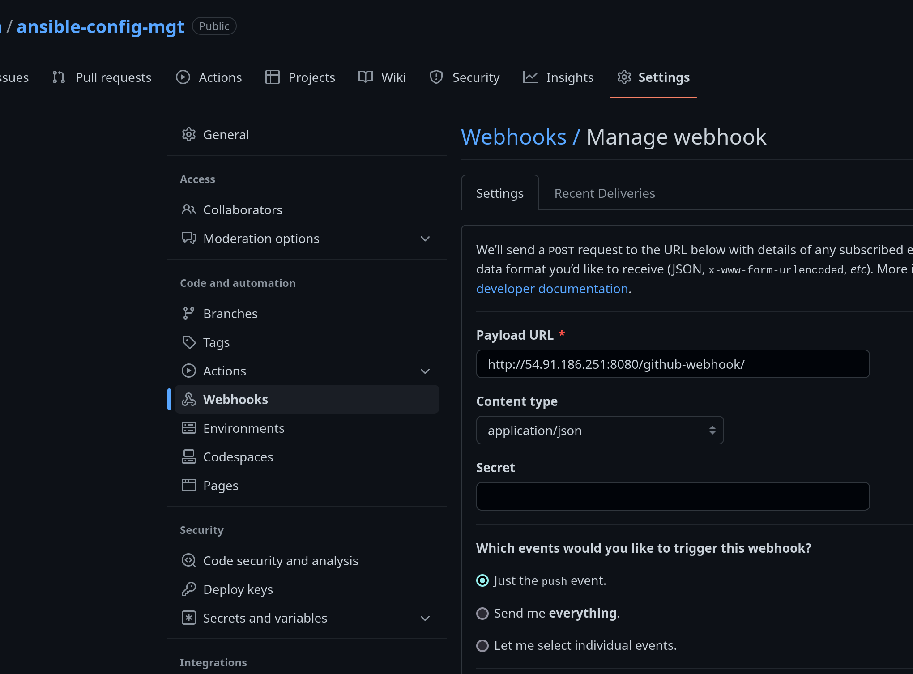
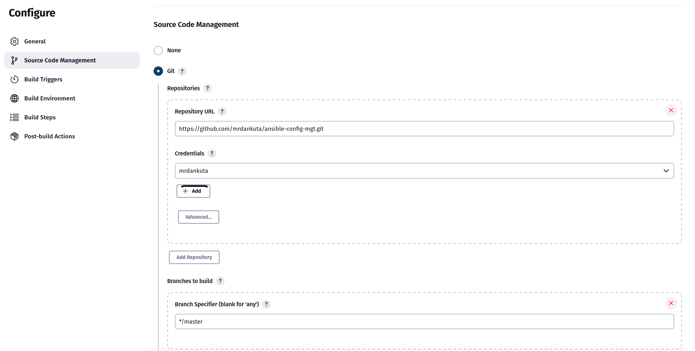
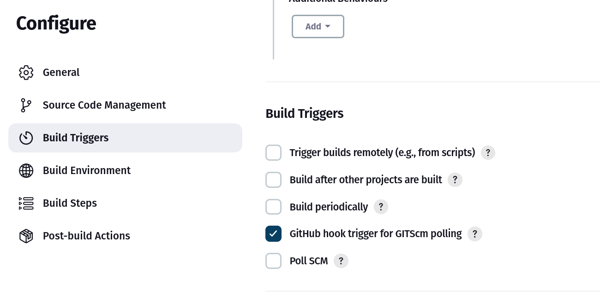
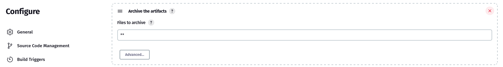
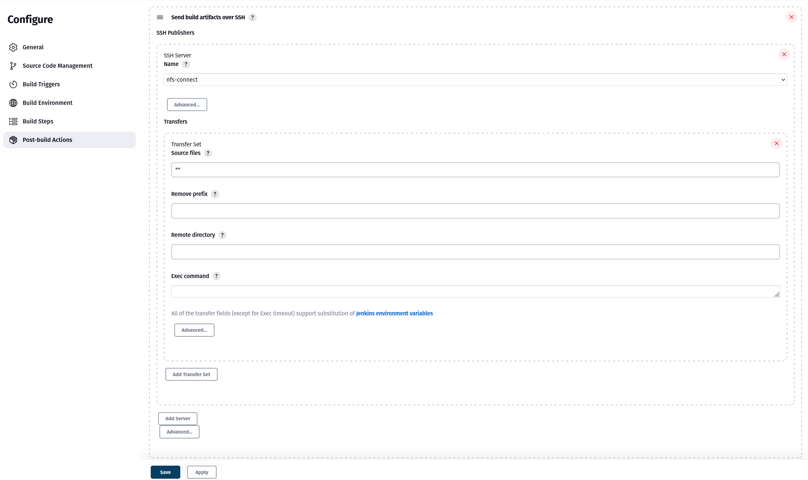
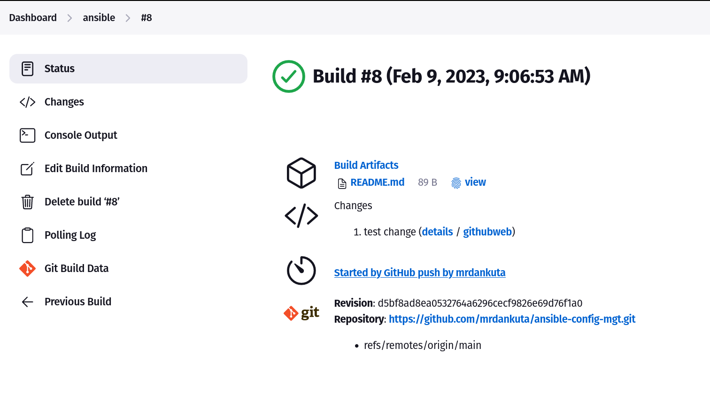

# Project 11 - Ansible – Automate Project 7 to 10


---

## Step 1 - Install & Configure Ansible
- Rename `jenkins` server name tag from previous projects to `jenkins-ansible` in EC2 and SSH into server.
- Install `Ansible`:
  ```
  sudo apt update
  sudo apt install ansible
  ```
- Check `ansible` version to confirm installation: 
  ```
  ansible --version
  ```
  

  ## Step 2 - Configure Jenkins Server to copy file to NFS server via SSH

- Goto Jenkins Dashboard `http://<jenkins-server-public-ip-address>:8080` in browser to begin Jenkins configuration
- Create new job/project. Give it a name `ansible`, select `Freestyle project` and click `ok`
    
- Connect jenkins project to Github repository via Webhook by adding `http://<jenkins-server-public-ip-address>:8080/github-webhook/` as the payload URL in Settings -> Webhook in Github repository
    
- In Jenkins project, under configuration -> Source Code Management, select `Git`, enter Github repository URL and credentials, save.
    
- Configure automatic triggering from Github Webhook
    
- Configure all build files to be archived
  
- Goto project configuration -> Post-build Actions -> Add `Send build artifacts over SSH` -> Select NFS server connection added in previous step -> Enter `**` in Source files field to transfer all artifacts
    
- Test automation by editing file(s) in repository and push the changes.
  